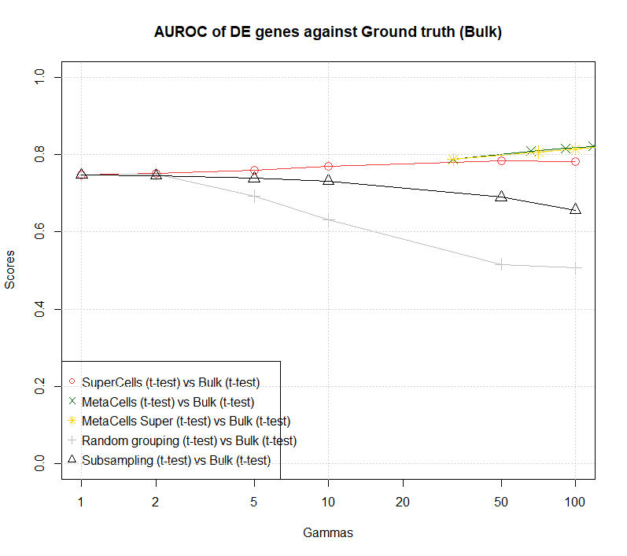
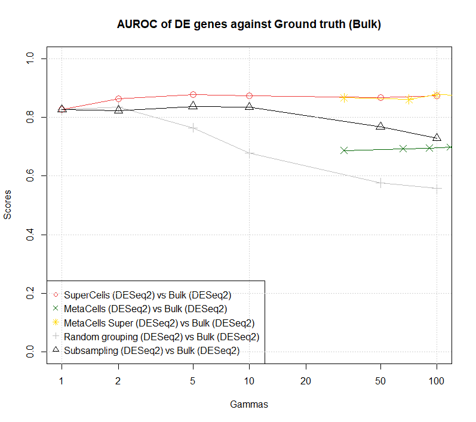
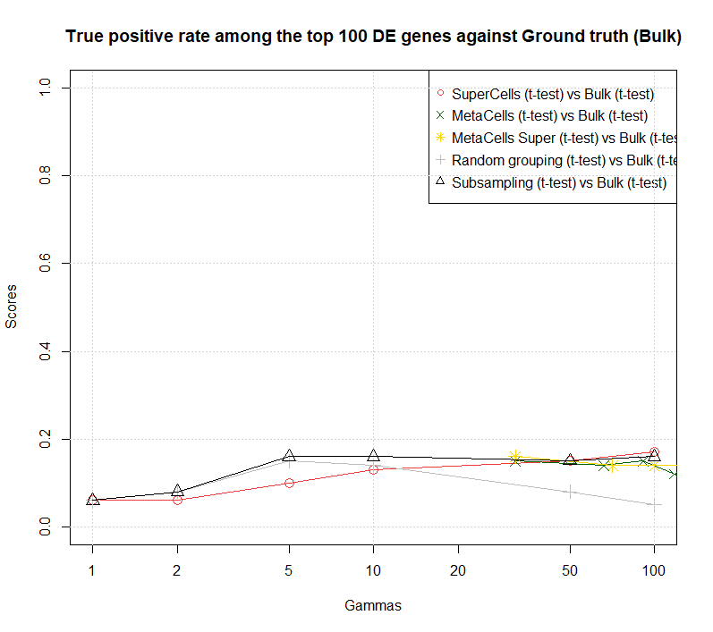
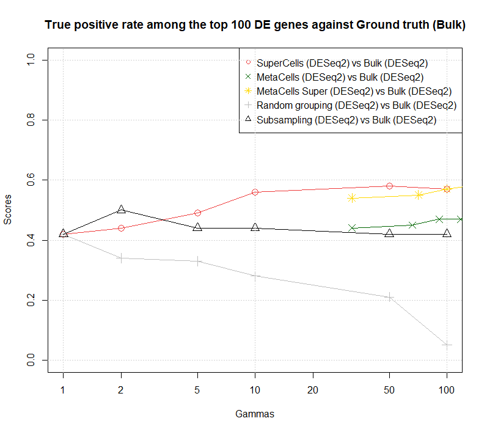
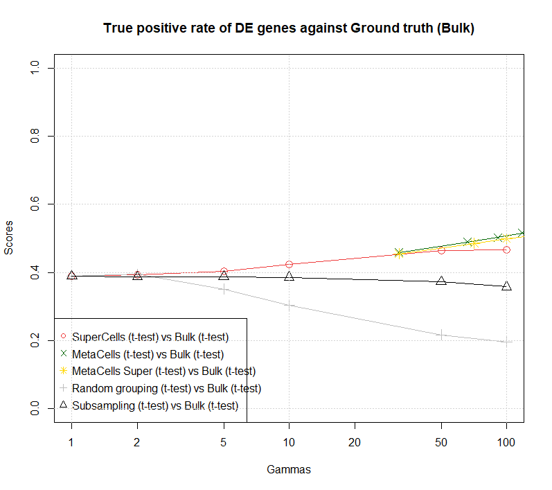
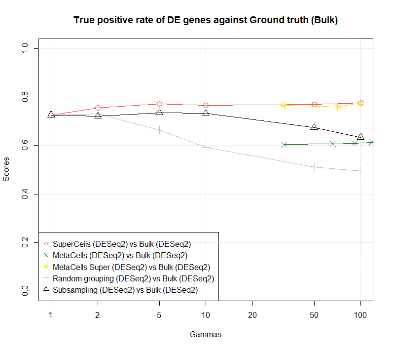

# README

This repo contains the necessary tools for a differential expression analysis and benchmarking
for the package [SuperCell](https://github.com/GfellerLab/SuperCell) in R.

The datasets used were found in a meta-anaysis on the false discoveries of single-cell differential expression ([Squair, J.W., Gautier, M., Kathe, C. *et al.*, 2021: Confronting false discoveries in single-cell differential expression](https://www.nature.com/articles/s41467-021-25960-2#citeas)). These datasets are considered as 'gold-standard' as single cells and bulk were obtained from the sample cell batch. Therefore, the bulk RNA may be referenced as the ground truth for this analysis.


## Table of contents

1. [Results](#results)
2. [Folder structure](#structure)
3. [Dependencies](#dependencies)
4. [Data](#data)
5. [Files](#files)
   1. [Processing](#processing)
   2. [Metacells](#metacell)
   3. [Differential expression](#DE)
   4. [Analysis](#analysis)
6. [Parameters](#parameters)

<a name="results"/></a>


## Results 

Here are some results obtained with this pipeline for the dataset hagai 2018 mouse. Cells were collected from 3 different mice before and after stimulation with lipopolysaccharide to trigger an immune response.

- Area under the curve score for different types of markers vs bulk (left: t-test, right: DESeq2)

  


- True positive rate between different markers and bulk for the top N = 100 genes (left: t-test, right: DESeq2)

  

  

- True positive rate between different markers and bulk for all statistically significant genes with p-value < 0.05 in the bulk (left: t-test with N = 1982, right: DESeq2 with N = 4440)




<a name="structure"/></a>


## Folder structure 

.  
|----- data  
|----- configs  
|----- figs  
|----- tests  
|----- src 


<a name="dependencies"/></a>

## Dependencies

Please find all dependencies in the DESCRIPTION file. Additionally, you will need to install these packages:

- Package [SuperCells](https://github.com/GfellerLab/SuperCell/tree/dev) from Gfeller lab, **use the dev version** (remotes::install_github("GfellerLab/SuperCell@dev"))

- Package [SuperCellBM](https://github.com/michelhugo/SuperCellBM) from Gfeller lab but modified to run with current analyses

- Package [Metacell](https://tanaylab.github.io/metacell/) from Tanay lab, **which runs only on Linux or Mac**.


<a name="data"/></a>


## Data

All data are available [here](https://doi.org/10.5281/zenodo.5048449). Run:
```
bash fetchData.sh
```
in the project folder in order to fetch the data.

Alternatively, you can download the files 'bulk_rnaseq.tar.gz' and 'sc_rnaseq.tar.gz', unzip them and place them in the data folder.

All datasets come for four different studies with published papers:

- [Hagai et al., 2018: Gene expression variability across cells and species shapes innate immunity](https://www.nature.com/articles/s41586-018-0657-2)
- [Cano-Gamez et al., 2020: Single-cell transcriptomics identifies an effectorness gradient shaping the response of CD4+ T cells to cytokines](https://www.nature.com/articles/s41467-020-15543-y)
- [Angelidis et al., 2019: An atlas of the aging lung mapped by single cell transcriptomics and deep tissue proteomics](https://www.nature.com/articles/s41467-019-08831-9)
- [Reyfman et al., 2019: Single-cell transcriptomic analysis of human lung provides insights into the pathobiology of pulmonary fibrosis](https://www.atsjournals.org/doi/10.1164/rccm.201712-2410OC)


Note that data from Cano-Gamez are not in appropriate form for direct analysis (disparities between count matrix and meta data in bulk file), therefore original data, dowloaded directly form the study, may be needed.

Moreover, Reyfman data for the bulk appears directly as a DE table (with p values) and not as count data. Either use directly this as ground truth, or recover the original data as well.

<a name="files"/></a>

## Files

The pipeline is runnable via the run files: 'runProcessing.R', 'runMetacell.R', 'runDE.R' and 'runAnalysis.R', respectively.

Any file can be run with:
```
Rscript runFile.R configs/myConfigFile 
```
where both 'runFile.R' and 'configs/myConfigFile' should be replaced with the corresponding files. The configuration file contains all the meta-data that should be used for a pipeline. You can find an example in the configs folder if you want to create one for another dataset.

Alternatively, one can source the file in Rstudio directly but should replace under HEADER the line:
```
args <- commandArgs(trailingOnly = TRUE)
```
by:
```
args <- "myConfigFilePath"
```

**Note**: Each run files includes manually some library paths, which may be needed in some cases. Please comment or replace under HEADER the line:

```
.libPaths("C:/Users/miche/OneDrive/Documents/R/win-library/4.1")
```
with what is needed accordingly.

<a name="processing"/></a>

### runProcessing.R
This load the raw data and apply all the processing on bulk and single-cell data. It is advised to choose the filtering parameters according to the quality control figures obtained after the first run, then re-run with appropriate parameters.

All processed data will be stored in the data folder, under the corresponding dataset used folder. Both normalized logcounts and non-normalized counts can be accessed in saved data, as Seurat objects can contain both. Use *data@assays$RNA@data* for normalize data and *data@assays$RNA@counts* for counts.

<a name="metacell"/></a>

### runMetacell.R

This creates the Metacells at different graining levels and store the footprint matrix and cell memberships.
Careful, the Metacell package uses heavy computation functions, this could take a while to run.

As mentioned above, this can only run on Linux or Mac. For Windows users, you can download a virtual machine along an .iso image and run this script on it.

The final metacells object are stored under data/datasetname/mc

<a name="DE"/></a>


### runDE.R
It contains all the differential expression computations for single-cell, bulk, pseudo-bulk, supercell, metacell, subsampling and random grouping.
**Please check the dependencies** as this requires the [dev version](https://github.com/GfellerLab/SuperCell/tree/dev) of SuperCell and a [modified version](https://github.com/michelhugo/SuperCellBM) of SuperCellBM!!

You can select in the config file which DEs you want to run and with which algorithm to compute them. The available algorithms are: 

- t-test
- [DESeq2](https://bioconductor.org/packages/release/bioc/html/DESeq2.html)
- [EdgeR](https://bioconductor.org/packages/release/bioc/html/edgeR.html)

Both DESeq2 and EdgeR are meant for bulk or pseudo-bulk analysis, therefore their use on single-cell level data will take some time.

All DE results will be saved under data/dataset_name_results. The GT folder (for ground truth) will contain data from the bulk, whereas the other markers will be stored in markers_splitCondition/.

Additionally, this will compute and save SuperCells under data/dataset_folder_data/SC

<a name="analysis"/></a>

### runAnalysis.R

After the differentially expressed markers have been computed in runDE, it is time to analyse the results via different plots and figures:

- Benchmarking plot to compare bulk, supercell, metacell, random grouping and subsampling
- Volcano plot to observe p-values vs logFCs
- LogFC-logFC plot to show the geometric vs arithmetic average computation of the gene-expression matrix of supercells
- Rank plot to oberve top N genes ranking at different gammas
- Weighted vs un-weighted t-test to show the effect of weighted t-test (with Supercell sizes as weights) on the p-values
- Fraction genes, which shows which genes are found by which method and the evolution with increasing gammas

Of course feel free to modify them and create new analyses!


<a name="parameters"/></a>

## Configs parameters

Some parameters in the config file can completely change the results and knowing the effect of each one is important.

- **filename**: Specify which dataset will be used for the analysis. The available names are:

  - Hagai2018_mouse-lps
  - Hagai2018_mouse-pic
  - Hagai2018_pig-lps
  - Hagai2018_rabbit-lps
  - Hagai2018_rat-lps
  - Hagai2018_rat-pic
  - Angelidis2019_pneumo
  -  Angelidis2019_alvmac
  - CanoGamez2020_naive-iTreg
  - CanoGamez2020_memory-Th17
  - CanoGamez2020_memory-Th0
  - CanoGamez2020_memory-Th2
  - Reyfman2020_alvmac
  - Reyfman2020_pneumo

  All functions were tested on Hagai2018_mouse-lps and may not work on other datsets depending on the parameters passed

- **intermediaryDataFile**: Create a dataset-named folder under data/ to store all computed data files

- **resultsFile**: Create a dataset-named folder under data/ to store all computed markers from runDE

- **ctrl_vs_treat**: In the case of two conditions (treatment vs control), specify the name which corresponds to treatment and the one to control under data$label. All the downstream analysis is based on this for the computation of DE genes

- **filteringParam**: All filtering parameters used in runProcessing for the single-cell data

  - doubletMaxPercentile: After the doublet score computation, specify which percentage of data should be kept based on this score. Therefore, the highest 1 - doubletMaxPercentile doublet scores are dropped, as they will be considered to be doublets. Check the package [scDblFinder](https://bioconductor.org/packages/release/bioc/html/scDblFinder.html) for more details
  - minGenePerCell: Define the minimum number of different genes that should be in a cell. Cells with less genes will be dropped
  - minCountPerCell: Define the minimum number of counts per cell. Cells with less counts will be dropped
  - minCountPerGene: Define the minimum number of counts per gene. Genes with less counts will be dropped
  - maxRiboPercent: Define the maximum percentage of ribosomic genes for a cell. Cells with a higher fraction of ribosomic genes will be dropped
  - maxMitoPercent: Define the maximum percentage of mitochondrial genes for a cell. Cells with a higher fraction of mitochondrial genes will be dropped
  - maxHbPercent: Define the maximum percentage of hemoglobin genes for a cell. Cells with a higher fraction of hemoglobin genes will be dropped

  All these parameters should be carefully considered after quality control. Run runProcessing once for QC and then choose appropriate parameters and re-run it.

- **normMethod**: Normalization method for single-cell data. Can be either 'seurat', to call the basic method from Seurat or 'DESeq2', which computes the dispersion estimates parameters for normalization (takes more time). The basic Seurat method was used for the analysis, even though it does not take into account the normalization of difference in RNA composition

- **computeCluster**: Whether or not clusters should be computed and assigned to single-cell data in the sample field. It uses the cluster centers from the centers parameter to assign the samples. As this is very sketchy, we recommend not to use it.

- **centers**: Centers of the clusters if computeCluster is set to TRUE (not recommended)

- **splitBy**: Define how the SuperCells will be constructed: by splitting them by samples or condition (label). The SuperCells will be constructed for each group independently and these may affect the membership assignement. Also affect the random grouping and subsampling. Can be either 'sample' or 'label', with the latter used for the analysis.

- **gammas**: Graining-level for the Supercells, which can span from 1 to N, N being the maximum number of cells in a group (label or condition)

- **algos**: The algorithms that will be used for the differential expression computation. A list can be passed, containing any of 't-test', 'DESeq2' and 'EdgeR'

- **DE**: Each element under this field specify whether of not to compute the corresponding DE (single-cell, bulk, pseudobulk , ...). Each one can be set to TRUE or FALSE according to your needs (re-calculation, markers for analysis, etc.)

- **compute_supercell**: Parameter to force the computation of supercells (TRUE) or to try to load the data (FALSE) if available in data/dataset_name_data/SC. If the data are not available, they will automatically be computed